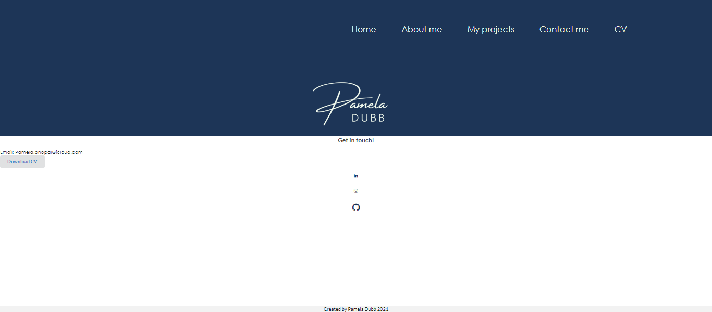

# Pamela Dubb Portfolio

<h2> Table of Contents </h2>

- [Project Link](#project-link)
- [Description](#description)
- [What did we do](#what-did-we-do)
- [Getting Started](#getting-started)
- [Screenshots](#screenshots)

## Project link

Click [here](https://pdubb3.github.io/pamela-dubb/) to view project on Github pages

## Description

In this project, I have created a updated version of my original personal portfolio. In this portfolio I have created the following additional pages;

- About me
- My projects
- Contact me
- Downloadable CV

## What did we do?

Created a updated portfolio which includes the following requirements:

- [x] Updated portfolio featuring Project 1 and 2 homework assignments.
- [x] Display fullname, email and number.
- [x] Links to Github profile and LinkedIn profile.
- [x] Link to downloadable PDF of resume.
- [x] Updated portfolio featuring Project 1 and 2 homework assignment, including title, link to deployed version, github and screenshot of application.
- [x] Mobile responsive user interface
- [x] Colour palette chosen from coolers
- [x] Updated GitHub profile

## Getting started

- Create a new GitHub repository called updated-pamela_portfolio
- Clone github project onto your local machine
- Navigate into the project

- Open the project into VS code

```
git clone git@github.com:PDUBB3/updated-pamela_portfolio.git
cd updated-pamela_portfolio
code .
```

- Create `README.MD` file
- Create `index.html` file
- Create `myprojects.html` file
- Create `contactme.html` file
- Create `aboutme.html` file
- Create assets, cv, js and images folder
- Create `Style.css` file
- Create `projects.js` file

## Screenshots

### Screenshot showing homepage of portfolio


### Screenshot showing about me page


### Screenshot showing my projects page


### Screenshot showing contact me page



### Screenshot showing responsive layout on iphone


